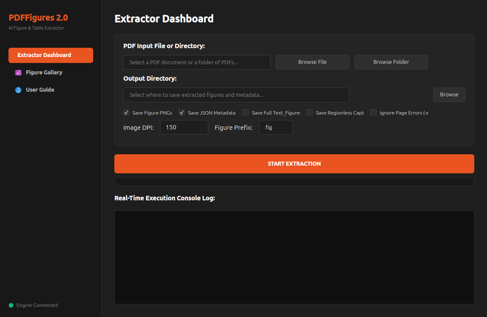

# PDFFigures 2.0 (with Yaru-Dark PySide6 Desktop GUI)

This repository is an enhanced distribution of the official **PDFFigures 2.0** engine developed by the Allen Institute for AI (AI2). On top of the original high-performance Scala-based CLI figure and table extractor, we have built a **state-of-the-art native PySide6 (Qt6) Ubuntu desktop application** styled with the gorgeous Ubuntu Yaru-Dark design system, integrating native GNOME desktop portals and a real-time console.

This structure allows you to build, run, and explore extracted figures visually through an interactive GUI or from a global command line, while completely sandbox-isolating dependencies using Anaconda!



---

## 🎨 PySide6 Desktop GUI Highlights
- **Ubuntu Yaru-Dark Theme:** Tailored dark interface with deep charcoal colors, bright flat cards, smooth transition states, and signature Ubuntu Orange (`#E95420`) highlights.
- **Native Nautilus File Dialogs:** Integrates natively with the Linux XDG Desktop Portal to open the beautiful system Nautilus file explorer (Recent, Home, Documents) instead of ancient blocky dialogs.
- **Threaded Async Worker:** Uses background `QThread` workers so the main window remains fluid and interactive during heavy batches of page processing.
- **Live Terminal Logging Console:** Features an integrated monospace terminal console that captures extraction logs in real time and automatically tags them with dynamic colors.
- **Interactive Thumbnails Grid:** Renders a clean grid layout of all extracted figures and tables. On-hover highlights raise cards dynamically.
- **Rich Zoom Modals:** Clicking a figure card launches an elegant sub-dialog featuring the full-res figure render in a large view pane on the left, and a scrollable text card containing the complete extracted caption on the right.
- **Troubleshooting Parameter Switches:** Adds toggle options directly in the dashboard:
  - **Save Regionless Captions (`-c`)**: Keeps captions in JSON even if their coordinate box cannot be found.
  - **Ignore Page Errors (`-e`)**: Prevents the extraction from halting due to a parsing error on a single page.
- **Mutual Exclusivity Enforcement**: Automatically manages conflicting options like JSON Metadata (`-d`) and Full Text (`-g`) to prevent command execution errors.
- **Interactive Bilingual Help Guide**: Built-in dynamic tab (`User Guide`) that details step-by-step application usage and lists solutions for common extraction problems in both English and Turkish.
- **Dynamic Figures Counter**: Displays the total count of loaded figures dynamically in the bottom-right corner of the Gallery.

---

## 🔧 Core Scala Engine Improvements
- **Hierarchical/Multi-dot Figure Numbering Support**: Patched `CaptionDetector.scala`'s `captionNumberRegex` to support complex hierarchical figure labels (e.g., `Figure 11.3.1`, `Figure 2.1.4`) that would otherwise trigger duplicate-name drops (the default engine dropped any set with >3 duplicate names like `11.3`).

---

## 🚀 Quick Setup & Installation (Sandboxed Conda)

We resolve all dependency conflicts (e.g. older Scala versions and newer Java versions) and protect your global system libraries by keeping all components safely within a dedicated conda environment.

### 1. Create and Configure Conda Environment
Ensure you have Anaconda or Miniconda installed, then run:
```bash
# Create dedicated environment
conda create -n pdffigures2-env python=3.10 -y

# Install OpenJDK 11 and SBT from conda-forge (avoids Java 25 compatibility bugs with Scala 2.12)
conda install -n pdffigures2-env -c conda-forge openjdk=11 sbt -y

# Install Python UI and image processing libraries
conda run -n pdffigures2-env pip install PySide6 pillow
```

### 2. Compile the Scala Engine
Compile the standalone fat JAR within the conda sandbox:
```bash
conda run -n pdffigures2-env sbt assembly
```
*This produces `pdffigures2.jar` directly in the project root folder.*

### 3. Running the App

- **Launch the Desktop GUI:**
  ```bash
  conda run -n pdffigures2-env python gui.py
  ```
  *(Or double-click the `PDFFigures 2.0` launcher pinned to your Linux Desktop, which is fully configured to execute this command!)*

- **Run the Global Terminal CLI Wrapper:**
  A terminal wrapper script is located at `~/.local/bin/pdffigures2`. It automatically launches the engine inside the conda sandbox:
  ```bash
  pdffigures2 -m /output/path/fig_prefix -d /output/path/ /path/to/paper.pdf
  ```

### 4. Windows Standalone Executable (No Python Required)
You can easily bundle the GUI into a standalone Windows `.exe` application so that Windows users can run it without needing to install Python, Conda, or PySide6 (Java is still required to run the JAR in the background).

1. Copy the project folder to a Windows machine.
2. Double-click the `build_windows.bat` file located in the root directory.
3. The script will automatically install dependencies and use **PyInstaller** to compile the application and bundle the required `.jar` and `.png` assets.
4. The final standalone application will be generated in `dist/PDFFigures2/PDFFigures2.exe`.

---

## 📑 Citation & Original Work

The underlying extraction logic and computer vision models are developed by the Allen Institute for Artificial Intelligence (AI2). If you use this tool or GUI in your research work, please cite the original authors' paper:

> Clark, C., & Divvala, S. (2016). **PDFFigures 2.0: Mining Figures and Tables in Scholarly Documents.** In *Proceedings of the 16th ACM/IEEE-CS on Joint Conference on Digital Libraries (JCDL)*. JCDL '16.
> - **Original Repository:** [allenai/pdffigures2](https://github.com/allenai/pdffigures2)
> - **Research Paper PDF:** [http://ai2-website.s3.amazonaws.com/publications/pdf2.0.pdf](http://ai2-website.s3.amazonaws.com/publications/pdf2.0.pdf)

Licensed under the [Apache License, Version 2.0](LICENSE.txt).